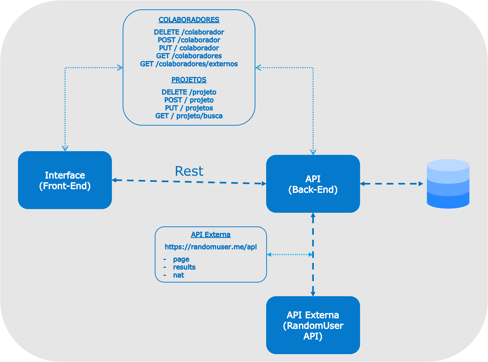

# Frontend - Dashboard de Gerenciamento de Projetos
  
Esta é uma SPA (Single Page Application) desenvolvida para consumir a API de gerenciamento de projetos de engenharia. A aplicação foi construída utilizando apenas **HTML, CSS e JavaScript puro**, com o auxílio do framework de estilo **Bootstrap**.
  
## Funcionalidades
  
- **Dashboard Principal**: Navegação central para as principais seções da aplicação.
- **Gerenciamento de Projetos**:
  - Visualização de todos os projetos em formato de cards.
  - Criação, edição (via modal) e remoção de projetos.
  - Busca dinâmica por nome de projeto com otimização (debounce).
- **Gerenciamento de Equipe**:
  - Visualização da lista de colaboradores cadastrados.
  - Adição, edição (via modal) e remoção de membros da equipe.
  - Busca de engenheiros externos (integração com a API RandomUser) com filtros por nacionalidade e nível de cargo, suporte a paginação e pré-preenchimento automático dos dados e foto no formulário de cadastro.
- **Cronograma de Projetos**:
  - Visualização em formato de gráfico de Gantt da alocação dos projetos.
  
---
  
## Instruções de Execução
  
### Pré-requisitos

1. A **API backend** deve estar em execução (`http://127.0.0.1:5000`).
2. Um navegador web moderno (Chrome, Firefox, Edge, etc.).
3. Docker instalado (caso opte por executar via contêiner).
  
### Como Rodar

#### Opção 1: Execução Direta (Sem Docker)
Basta abrir o arquivo `index.html` diretamente no seu navegador. Não é necessário nenhum servidor web, build ou dependência adicional para executar o frontend.

#### Opção 2: Execução via Docker

1. Certifique-se de estar na pasta raiz do projeto.
2. Construa a imagem Docker:
   ```bash
   docker build -t frontend-dashboard .
   ```
3. Inicie o contêiner mapeando a porta desejada (por exemplo, porta `8080` do host para a porta `80` do contêiner Nginx):
   ```bash
   docker run -d -p 8080:80 --name frontend-dashboard-app frontend-dashboard
   ```
4. Acesse no navegador:
   ```text
   http://localhost:8080
   ```

> Para parar e remover o contêiner:
> ```bash
> docker stop frontend-dashboard-app && docker rm frontend-dashboard-app
> ```

---

## Arquitetura do Sistema

Visão geral da comunicação e do fluxo de dados entre a Single Page Application (SPA), o servidor web Nginx, a API Backend e as integrações externas:

<div align="center">
  
  <p><em>Fluxograma da arquitetura e fluxo de integração entre os componentes</em></p>
</div>

> **Nota**: Quando tiver a imagem do fluxograma pronta, salve-a no caminho indicado (por exemplo, criando uma pasta `assets/` e nomeando o arquivo como `arquitetura.png`) ou altere o atributo `src` para o caminho onde a imagem for salva.

---